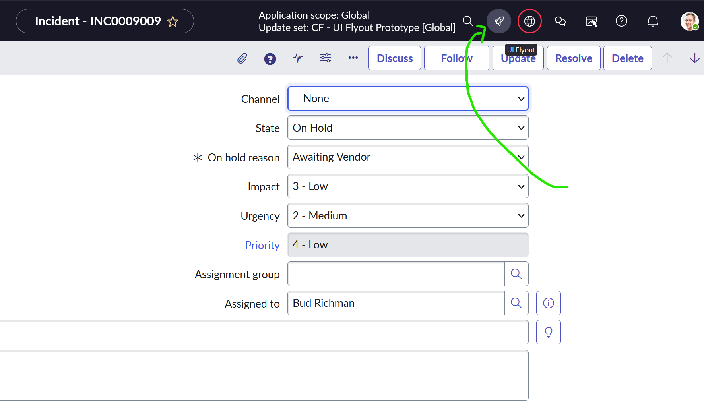
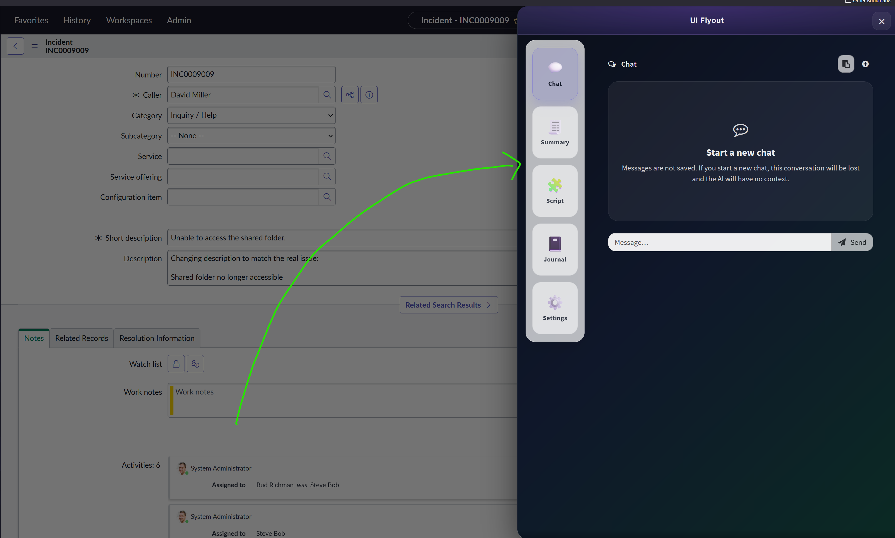
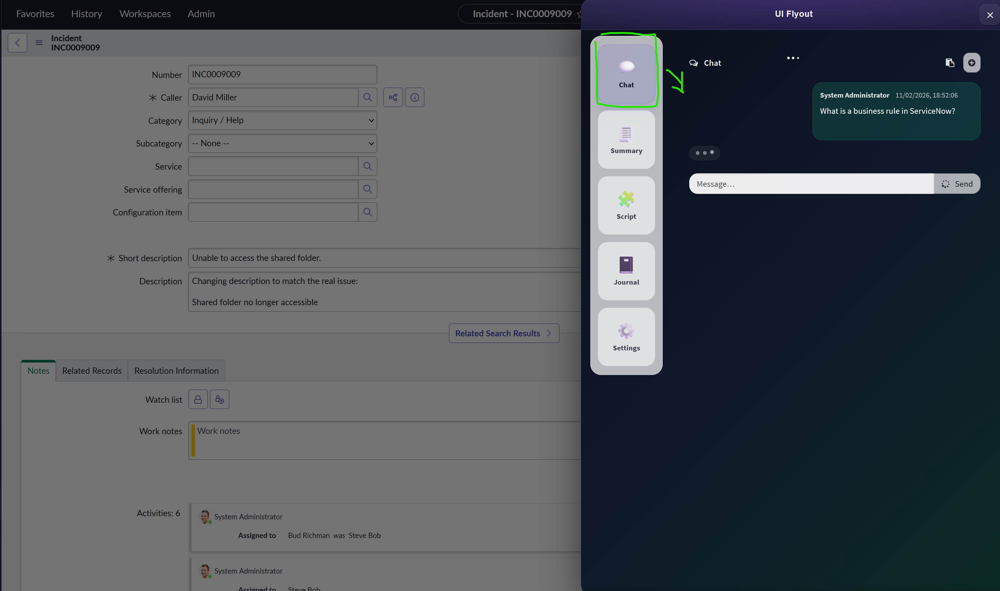
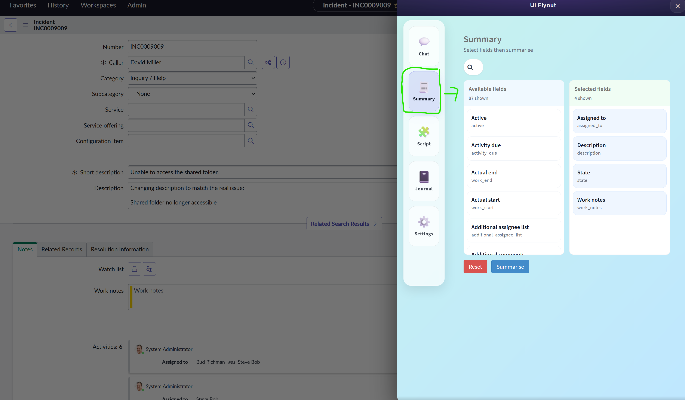
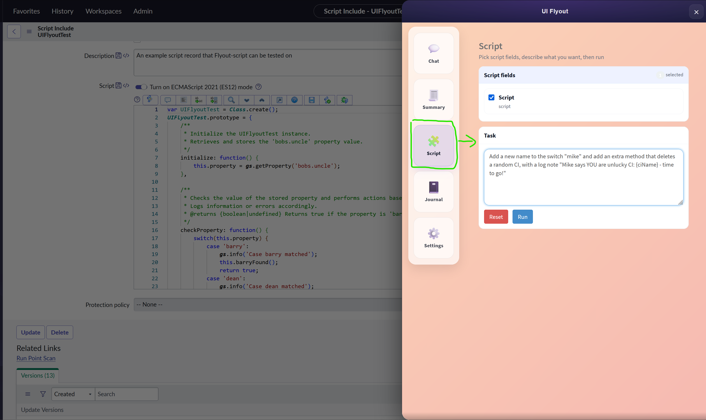

# ServiceNow UI Flyout (Prototype)

A lightweight “Action Center” flyout for the ServiceNow backend UI (Polaris + UI16) that injects a header icon and opens a right-side drawer containing a Service Portal page and embedded widgets (Chat, Summary, Script, Settings).

> ⚠️ Disclaimer  
> This is provided for learning / experimentation.  
> Do not deploy to production without proper testing, security review, and approval.

---

## What it does

- Injects a header icon in the ServiceNow backend (Polaris header or UI16 header)
- Opens a right-side flyout drawer (iframe) to a Service Portal page
- The portal page hosts **Flyout Action Center** which provides a tabbed experience:
  - Chat
  - Summary
  - Script
  - Settings
  - (Optional) Journal Admin Hub tab if `x_cros2_journal_0` exists on the instance

---

## Included components

### Backend UI injection
- **UI Script:** `ui_flyout_rocketship`  
  Injects the icon into the header and manages flyout open/close, drawer, backdrop, and iframe URL context.

### Portal surface
- **Portal Page:** `flyout_example`  
  Entry point for the flyout iframe (example page).

- **Widget:** `flyout-action-center`  
  The primary widget that embeds other widgets and renders them in the iframe of the flyout.

### Action Center
- **Widget:** `flyout-action-center`  
  Tab navigation + dynamic child widget rendering.

---

## Embedded widgets (and their Script Includes)

### 1) Chat

- **Widget ID:** `flyout-chat` (Flyout Chat)
- **Purpose:** One-session chat using OpenAI Responses API with optional chaining via `previous_response_id`.
- **Script Includes:**
  - `UiFlyoutOpenAI`  
    Low-level REST wrapper for “Flyout - OpenAI” REST Message (Completions + Responses).
  - `UIFlyoutLLMClient`  
    Higher-level “chat-like” helpers for first / next turn patterns (where implemented).
  - `UIFlyoutChatService` *(prototype / optional)*  
    If unused in your current build, you can remove it.

- **Notes:**
  - Chat history is not persisted by default (client-only state).
  - Markdown rendering can be enabled in the widget using `marked` + `DOMPurify` JS Includes.

### 2) Summary

- **Widget ID:** `flyout-summary` (Flyout Summary)
- **Purpose:** Select record fields (including inherited fields) and generate a summarised output.
- **Script Include:**
  - `UIFlyoutSummariser`  
    Reads record + audit history (ACL-respecting patterns where applicable), builds field metadata, and generates a summary via LLM.

### 3) Script

- **Widget ID:** `flyout-script` (Flyout Script)
- **Purpose:** Script assistance / generation surface (patterned similarly to other flyout apps).
- **Script Include:**
  - `UIFlyoutScriptService`  
    Server-side helpers for script-related prompts/actions.
  - `UIFlyoutLLMClient`  
    LLM call helper used by the script surface.

### 4) Settings

- **Widget ID:** `flyout-settings` (Flyout Settings)
- **Purpose:** Toggle / control flyout preferences that other widgets respect.
- **Script Include:**
  - `UIFlyoutPreferences` 
    Stores per-user preferences (last tab, summary field selections per table, etc.).

- **Current preferences (recommended)**
  - Remember last tab (`ui_flyout.pref.remember_last_tab`)
  - Default tab (`ui_flyout.pref.default_tab`)
  - Remember Summary selected fields (`ui_flyout.pref.summary_fields`)
  - Last tab stored value (`ui_flyout.last_tab`)
  - Summary fields per table (`ui_flyout.summary_fields.<table>`)

---

## OpenAI integration

### REST Message
- **REST Message:** `Flyout - OpenAI`
  - Method: `Completions`
  - Method: `Responses`

### System properties (configure before use)
- `ui_flyout_openai.api_key`
- `ui_flyout_openai.completions_model` (default: `gpt-4o-mini`)
- `ui_flyout_openai.responses_model` (default: `gpt-4o-mini`)

> 🔐 Security note: Never commit API keys. Use instance system properties, secrets management, or environment-specific deployment steps.

---

## Installation

1. Import the update set XML into your instance
2. Preview + Commit the update set
3. Ensure the **UI Script** is active: `ui_flyout_rocketship`
4. Confirm the portal page exists: `flyout_example`
5. Set required properties (OpenAI API key and model defaults)
6. Hard refresh the backend UI frame (Polaris/UI16) and confirm the icon appears

---

## Usage

1. Open any record in the backend UI (Polaris or UI16)
2. Click the flyout icon in the header
3. The flyout opens with the portal page embedded
4. Use tabs to open Chat / Summary / Script / Settings
5. (Optional) If Journal Admin Hub scope exists (`x_cros2_journal_0`), a Journal tab appears automatically. 
See also: [ServiceNow Journal Admin Hub](https://github.com/PrimeDemonic/servicenow_journal_admin_hub)

---

## Context passing (table/sys_id)

The flyout iframe URL is built with context when available:

- `table` and `sys_id` are derived from `g_form` when possible
- otherwise parsed from the current URL (Workspace, UI16 `nav_to.do`, direct `<table>.do?sys_id=...`, etc.)
- These parameters are passed into embedded widgets via Action Center `context`

---

## Troubleshooting

### Icon appears, but clicking breaks clicks after a frame reload
This usually indicates an event / overlay issue in the injected UI Script (e.g., stale handlers after frame reload, backdrop blocking, or DOM replaced under Polaris).  
Validate:
- Backdrop / drawer elements are removed correctly on close
- `pointer-events: none` is set on any fixed ::before backgrounds
- Only one active backdrop is present at a time

### OpenAI calls fail
- Confirm `ui_flyout_openai.api_key` is set
- Confirm instance can reach OpenAI endpoints (egress/network)
- Check the outbound HTTP log for request body + model values
- Ensure you are using Responses schema correctly (and chaining with `previous_response_id` if desired)

---

## Related projects
- [ServiceNow Journal Admin Hub](https://github.com/PrimeDemonic/servicenow_journal_admin_hub)

---

## License / attribution

MIT
